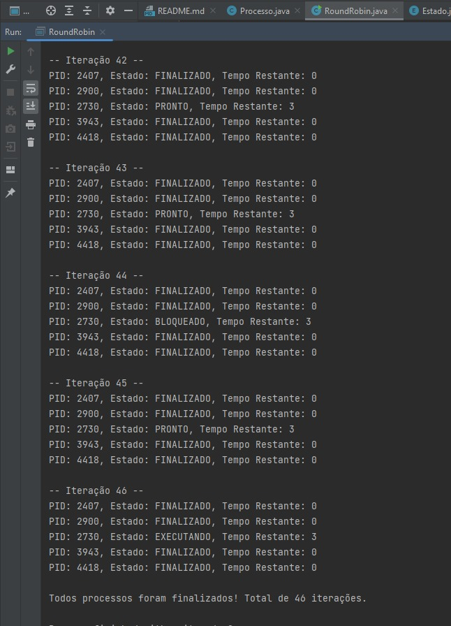

# Simulador de Escalonamento Round Robin

Este projeto é uma simulação do algoritmo de escalonamento Round Robin em Java. O objetivo é demonstrar como processos 
são gerenciados em um sistema operacional com base em fatias de tempo, garantindo que todos os processos recebam tempo 
de CPU de maneira justa.

## Descrição
O escalonamento Round Robin atribui a cada processo uma fatia de tempo (quantum) para ser executado. Se o processo não for concluído nesse tempo, ele retorna para a fila de prontos e outro processo é executado. O ciclo continua até que todos os processos sejam finalizados.

### Componentes Principais
1. Processo: Representa um processo com um identificador único (PID), estado e tempo restante de execução.

2. Estado: Os processos podem assumir diferentes estados:

   * Novo: Processo recém-criado.
   * Pronto: Processo pronto para ser executado.
   * Executando: Processo que está utilizando a CPU.
   * Bloqueado: Processo aguardando para voltar à fila de execução.
   * Terminado: Processo concluído.

3. RoundRobin: Gerencia a execução dos processos de acordo com o algoritmo Round Robin, aplicando o quantum definido para cada processo.

## Simulação das Interações

